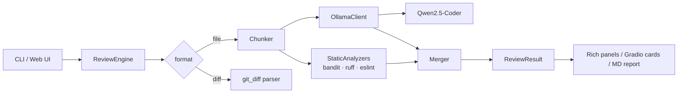

# CodeSentinel AI

> **Local AI Code Reviewer** — Detects bugs, security vulnerabilities, performance issues, style problems and missing documentation in your code. Runs entirely on your Mac. No cloud, no API keys.

   

CodeSentinel pairs a local large language model (Qwen2.5-Coder 7B via Ollama) with classic static analyzers (bandit, ruff, ESLint) so that AI findings are grounded in deterministic signal. It ships two ways to drive it: a colourised terminal CLI and a Gradio web UI.

---

## Quick start

```bash
git clone https://github.com/lindavlr/codesentinel-ai.git
cd codesentinel-ai
bash setup.sh                # installs Ollama, pulls model (~5 GB), creates venv
source .venv/bin/activate
make demo                    # CLI demo on bundled buggy fixtures
make web                     # launch web UI at http://127.0.0.1:7860
```

---

## What it detects

| Category | Examples |
|---|---|
| Bugs | mutable default args, off-by-one, NPE risks |
| Security | SQL injection, eval(), hardcoded secrets, XSS sinks |
| Performance | N+1 queries, quadratic loops, sync blocking I/O |
| Style | unused imports, missing types, dead code |
| Documentation | missing docstrings, undocumented params |

Five severity levels: `critical` · `high` · `medium` · `low` · `info`.

---

## Usage

### Terminal (CLI)
```bash
codesentinel review path/to/file.py
codesentinel review src/ --recursive --severity high
codesentinel diff --since HEAD~3
codesentinel models
codesentinel doctor
```

### Web (Gradio)
```bash
make web
```
Open <http://127.0.0.1:7860>, upload a file or paste code, browse colour-coded findings, download the report as Markdown.

---

## Architecture



See [docs/03_architecture.md](docs/03_architecture.md) for details.

---

## Why local?

Cloud code reviewers (CodeRabbit, Copilot for PRs, Cursor Review) ship your source code to remote servers. CodeSentinel runs the entire model on-device — your code never leaves your laptop. Same accuracy class as cloud-hosted 7B models, zero recurring cost, full data sovereignty.

---

## Documentation

- [01 — Project report](docs/01_report.md)
- [02 — Requirements](docs/02_requirements.md)
- [03 — Architecture](docs/03_architecture.md)
- [04 — Model card](docs/04_model_card.md)
- [05 — Prompt engineering](docs/05_prompt_engineering.md)
- [06 — Testing](docs/06_testing.md)
- [07 — Results](docs/07_results.md)
- [08 — Limitations](docs/08_limitations.md)
- [09 — Future work](docs/09_future_work.md)
- [10 — Presentation script](docs/10_presentation_script.md)
- [11 — Run book](docs/11_run_book.md)

---

## License

MIT © 2026 Linda Valentina Lopez Rubiano · Juan Felipe Andrade. See [LICENSE](LICENSE).

## Authors

**Linda Valentina Lopez Rubiano** · **Juan Felipe Andrade**

Proyecto 2 — *Inteligencia Artificial*, Universidad Surcolombiana (USCO).
Prof. Juan Antonio Castro Silva · Semestre 2026-I.
