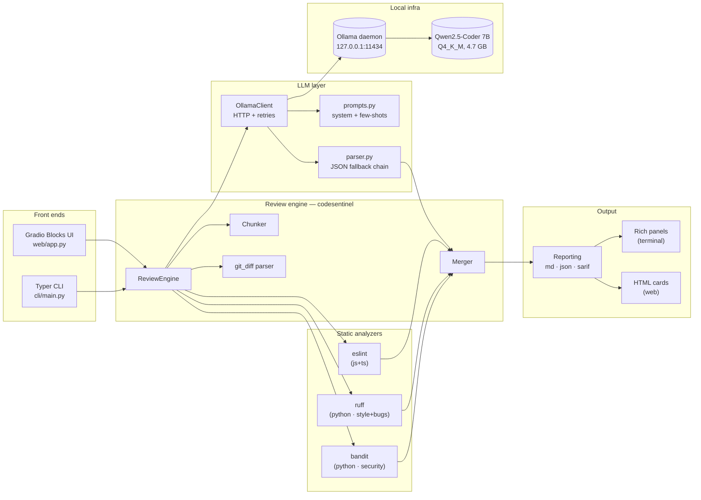
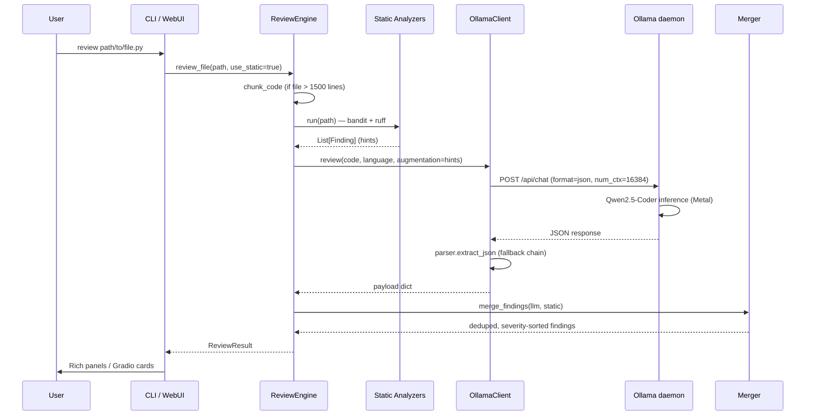

# Architecture

## System diagram

## Review sequence

## Package responsibilities

| Package | What lives there |
|---|---|
| `codesentinel.schema` | Pydantic models — `Finding`, `Severity`, `Category`, `ReviewResult` |
| `codesentinel.config` | `Settings` loaded from `.env` (model, host, ctx, timeouts) |
| `codesentinel.languages` | Extension → language map, display names |
| `codesentinel.llm.prompts` | System prompt + 2 few-shot examples + augmentation rendering |
| `codesentinel.llm.client` | Ollama HTTP wrapper (sync + async), 1-retry policy |
| `codesentinel.llm.parser` | Robust JSON extraction (5-step fallback chain) |
| `codesentinel.analyzers.*` | bandit / ruff / eslint subprocess adapters |
| `codesentinel.review.chunker` | Window-based splitting for files > N lines |
| `codesentinel.review.merger` | RapidFuzz-based dedup + severity-max merge |
| `codesentinel.review.git_diff` | Unified-diff parser → `{file: {changed_lines}}` |
| `codesentinel.review.engine` | Orchestrates all of the above |
| `codesentinel.reporting.*` | Markdown / JSON / SARIF serialisers |
| `cli.*` | Typer commands + Rich rendering |
| `web.*` | Gradio Blocks UI + HTML rendering |

## Technology choices and trade-offs

| Choice | Why | Alternative considered | Why rejected |
|---|---|---|---|
| **Ollama** | One-binary install on Mac, Metal automatic, stable HTTP API | llama.cpp directly | Lower-level, more setup, no built-in registry |
| **Qwen2.5-Coder 7B Q4_K_M** | Top HumanEval (~76) in its size class, ~4.7 GB, 40-80 tok/s on M5 | CodeLlama 7B / Llama 3.2 8B | Lower coding scores |
| **format="json" + few-shot** | Constrained decoding; Qwen is heavily JSON-trained | Free-form output | Brittle parsing, lower reliability |
| **JSON output (not YAML)** | LLMs are far better at JSON; Ollama has JSON mode | YAML | No constrained-decoding equivalent |
| **Pydantic v2** | Fast, well-typed, plays nicely with FastAPI/Gradio | dataclasses | No automatic validation |
| **Typer + Rich** | Modern Click wrapper, beautiful terminal output | argparse | Verbose, ugly help screens |
| **Gradio Blocks** | Fastest path to a polished web UI in Python | Streamlit / FastAPI+React | More boilerplate / less polished |
| **bandit + ruff + ESLint** | Industry-standard, fast, JSON output, runnable as subprocess | semgrep | Heavier install, optional in future |
| **httpx** | Sync + async in one lib, plays with respx in tests | requests + aiohttp | Two libs, two test mocking strategies |

## Data flow boundaries

- All **inbound** data flows from disk or the user-provided path. No network reads.
- The only **outbound** network call is `POST http://127.0.0.1:11434/api/chat` to Ollama. Loopback only.
- **Subprocess** boundary: static analysers run with a hard 120 s timeout and never raise out of `run_analyzers`.
- **LLM** boundary: bad output triggers exactly one retry at lower temperature; second failure surfaces as a `LLMError` and is logged, not crashed.
