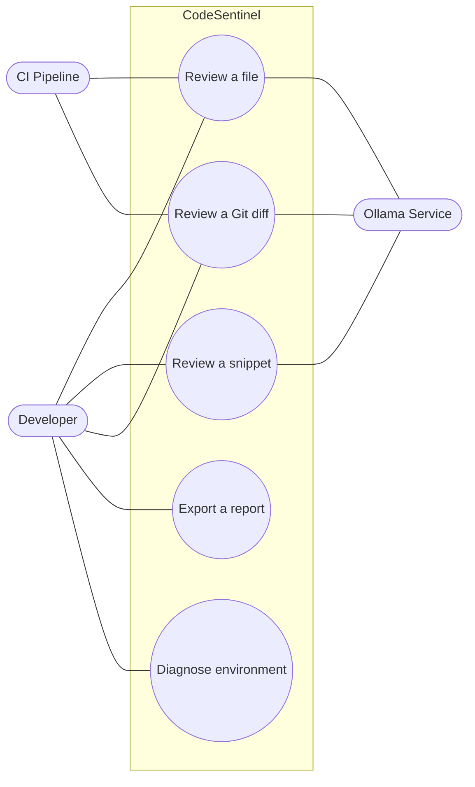
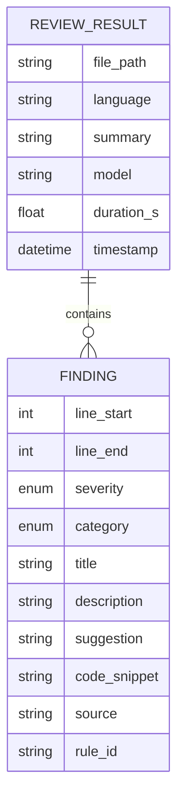
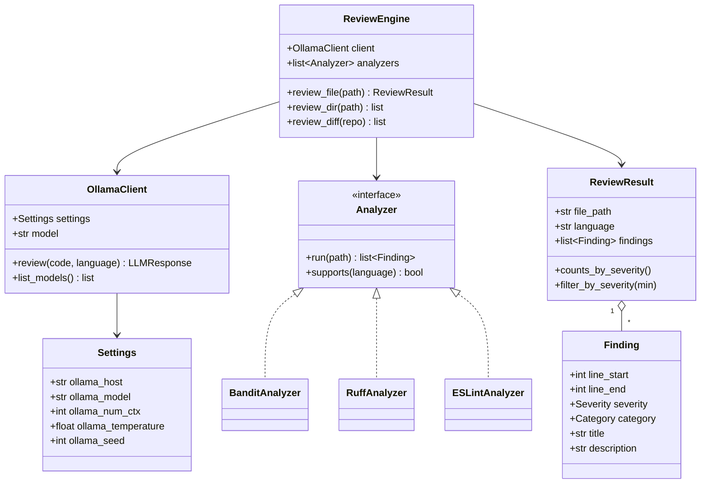
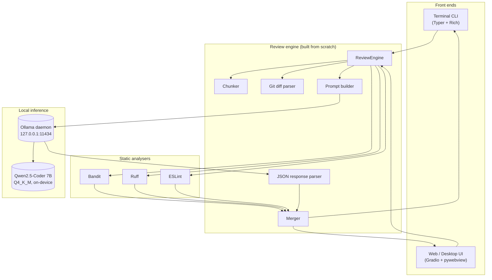

\newpage

# Abstract

CodeSentinel AI is a code-review assistant that runs entirely on the developer's own
computer. It reads a source file, a pasted snippet, or the changes in a Git commit and
returns a structured report of defects, security vulnerabilities, performance problems,
style issues, and missing documentation. Each finding carries a severity level, a line
reference, an explanation of why the issue matters, and a concrete fix.

The system is built around a quantised seven-billion-parameter language model
(Qwen2.5-Coder) served locally through Ollama. No source code ever leaves the machine:
the only network connection the application opens is to the loopback address
`127.0.0.1:11434`, where the model runs. Around that model we built an original review
engine that segments large files, asks the model for a strict JSON verdict, repairs
malformed responses, and fuses the model's judgement with the output of classic static
analysers (Bandit, Ruff, ESLint). The same engine drives two interchangeable front ends:
a colourised terminal application and a graphical web/desktop interface.

This document describes the problem, our objectives, the state of the art, the
requirements, the design (use cases, data model, class structure, interface mockups, and
service catalogue), the testing strategy, the proposed architecture, the measured
results, and our recommendations for future work.

\newpage

# 1. Introduction

Software teams produce code faster than human reviewers can keep up with. Code review
remains one of the most effective ways to catch defects before they reach production, yet
it is slow, it depends on the reviewer's experience and attention, and it does not scale
with the size of a codebase. Over the last two years a class of tools has appeared that
applies large language models (LLMs) to this task. Products such as GitHub Copilot's pull
request review, Cursor's review feature, and CodeRabbit can read a diff and flag real
problems at a quality comparable to a competent engineer.

These tools share one property that limits where they can be used: they are cloud
services. Every line of code under review is uploaded to a third-party server. For a
student handling coursework this is merely a privacy preference; for a company in a
regulated sector such as banking or healthcare it is often a legal impossibility, and for
an individual developer it is a recurring cost.

CodeSentinel AI was built to answer a single question: *can we obtain the same class of
review quality while keeping all source code on the developer's own machine?* The project
is the second of two assignments for the Artificial Intelligence course at Universidad
Surcolombiana. Its theme — "Artificial Intelligence applied to Software Engineering" — is
open, and the assignment specifies three constraints: the model must run locally, the
application must offer both a graphical interface and a terminal interface, and the work
is carried out by a team of two.

We chose to build an AI code reviewer. The model that performs the linguistic reasoning
is an open-source model that runs on-device; the engineering contribution of this
project — the part we designed and implemented from scratch — is everything that turns
that raw model into a usable, reliable reviewing tool: the prompt design, the response
parser, the chunking and merging logic, the integration with static analysers, the
reporting layer, and the two front ends. The remainder of this document describes that
contribution in detail.

# 2. Problem Statement

Manual code review has three well-documented weaknesses. It is **slow**, because it
competes for a senior engineer's time. It is **inconsistent**, because two reviewers (or
the same reviewer on two different days) apply different standards. And it **does not
scale**: the volume of code that needs review grows with the team, but reviewing capacity
does not.

Automated tooling addresses parts of this. Linters and static analysers such as Ruff,
Bandit, and ESLint are fast and deterministic, but they are rule-based. They recognise
only the patterns their authors encoded, they cannot reason about intent, and they are
blind to whole categories of problem — a misleading variable name, a logic error that is
syntactically valid, or a security issue that depends on how a value flows through the
program.

Cloud-hosted LLM reviewers close that reasoning gap, but at the cost of confidentiality.
They transmit proprietary source code to external infrastructure, they require a paid
subscription, and they depend on network availability.

The gap we address is therefore precise: **there is no widely available reviewer that
combines the semantic reasoning of a language model with the privacy and zero marginal
cost of a tool that runs locally.** CodeSentinel AI occupies exactly that gap.

# 3. Objectives

## 3.1 General Objective

To design and implement a code-review application that detects bugs, security
vulnerabilities, performance problems, style violations, and documentation gaps in real
source code, using a language model that runs entirely on the developer's machine, and
exposing the analysis through both a graphical interface and a terminal interface.

## 3.2 Specific Objectives

1. Run a state-of-the-art coding language model on a consumer laptop (Apple M5, 16 GB of
   unified memory) with no dependency on cloud services.
2. Define a structured output contract so that the model's free-form reasoning becomes
   typed, validated data that the rest of the system can process.
3. Combine the language model with deterministic static analysers so that findings are
   grounded and hallucinations are reduced.
4. Support the review of a single file, an entire directory, and the changed lines of a
   Git commit.
5. Cover the main languages used in software engineering courses: Python, JavaScript,
   TypeScript, and Java, with graceful handling of others.
6. Produce reports in several formats (terminal, Markdown, JSON, and SARIF) and persist
   them for later use.
7. Deliver a system that a non-expert can install and operate with a single command, and
   document it to an academic standard.

# 4. State of the Art, Background, and Related Work

## 4.1 Foundational Concepts

**Transformer language models.** Modern code models are based on the Transformer
architecture introduced by Vaswani et al. (2017). A decoder-only Transformer predicts the
next token in a sequence given the preceding tokens; trained on large corpora of source
code and natural language, such a model acquires a statistical understanding of
programming idioms, common bug patterns, and the relationship between code and its
description. CodeSentinel uses Qwen2.5-Coder, a model from this family specialised for
programming tasks.

**Quantisation.** A model with seven billion parameters stored at full 16-bit precision
would require roughly 14 GB of memory and exceed the budget of a typical laptop.
Quantisation reduces the numerical precision of the weights — in our case to a 4-bit
mixed scheme known as Q4_K_M — bringing the on-disk size to about 4.7 GB and the working
memory to roughly 6 GB, with only a small loss in output quality. This is what makes
on-device inference feasible.

**Local inference runtimes.** Ollama is an open-source runtime that loads a quantised
model and exposes it through a local HTTP API. On Apple Silicon it uses the Metal graphics
API automatically, so inference runs on the integrated GPU without any configuration.

**Static analysis.** Tools such as Bandit (security-focused, Python), Ruff (style and
common bugs, Python), and ESLint (JavaScript and TypeScript) parse source code into an
abstract syntax tree and match it against a catalogue of rules. They are fast and never
hallucinate, but they only see what their rules describe.

## 4.2 Existing Tools

The table below compares the principal options available in early 2026.

| Tool | Execution | Cost | Source code privacy | Open source |
|---|---|---|---|---|
| GitHub Copilot (PR review) | Cloud | Per-seat subscription | Uploaded to vendor | No |
| Cursor Review | Cloud | Per-seat subscription | Uploaded to vendor | No |
| CodeRabbit | Cloud | Per-seat subscription | Uploaded to vendor | No |
| Bandit / Ruff / ESLint | Local | Free | Stays local | Yes, but rule-based only |
| **CodeSentinel AI (this work)** | **Local** | **Free** | **Stays local** | **Yes** |

The cloud products provide language-model reasoning but require uploading code. The
classic analysers run locally and for free but cannot reason. CodeSentinel sits at the
intersection: language-model reasoning that runs locally.

## 4.3 Relationship to This Work

Our contribution is not the language model itself, which is a pre-existing open-source
component, but the system that makes it useful for reviewing code under the local-only
constraint. The closest published approach is the practice of "LLM-as-a-judge" combined
with tool grounding; we apply that idea specifically to code review and add an
engineering layer — strict output contracts, robust parsing, chunking, and analyser
fusion — that the raw approach lacks.

# 5. Requirements

## 5.1 Functional Requirements

| ID | Requirement |
|---|---|
| FR-01 | The system shall detect issues in five categories: bug, security, performance, style, and documentation. |
| FR-02 | The system shall assign each finding one of five severity levels: critical, high, medium, low, info. |
| FR-03 | The system shall report, for each finding, the affected line range, a title, an explanation, and a suggested fix. |
| FR-04 | The system shall review a single source file. |
| FR-05 | The system shall review a directory recursively. |
| FR-06 | The system shall review only the lines changed in a Git commit. |
| FR-07 | The system shall detect the programming language automatically from the file extension. |
| FR-08 | The system shall run the language model locally, with no request sent to any non-loopback address. |
| FR-09 | The system shall augment model findings with static-analyser findings when an analyser is available for the language. |
| FR-10 | The system shall expose its functionality through a terminal interface and through a graphical interface. |
| FR-11 | The system shall export reports as terminal output, Markdown, JSON, and SARIF. |
| FR-12 | The system shall persist the generated Markdown report to the user's Downloads folder. |
| FR-13 | The user shall be able to filter findings by minimum severity. |
| FR-14 | The user shall be able to choose the natural language of the report (English or Spanish). |
| FR-15 | The system shall provide a self-diagnostic command that verifies the environment. |

## 5.2 Non-Functional Requirements

| ID | Requirement | Target |
|---|---|---|
| NFR-01 | Privacy: no network traffic to non-loopback addresses. | 0 external requests |
| NFR-02 | Latency on a warm model. | ≤ 30 s per file |
| NFR-03 | Memory footprint during inference. | ≤ 8 GB |
| NFR-04 | Disk footprint. | ≤ 10 GB total |
| NFR-05 | Reproducibility: identical input yields identical output. | Fixed random seed |
| NFR-06 | Test coverage on the core engine modules. | ≥ 80 % |
| NFR-07 | Installation effort. | Single setup command |

# 6. Use Cases and User Stories

## 6.1 Actors

- **Developer.** The primary user. Submits code and reads the resulting findings.
- **CI pipeline.** A non-human actor that invokes the terminal interface and reads its
  exit code to pass or fail a build.
- **Ollama service.** A local supporting actor that performs model inference on request.

## 6.2 User Stories

- *As a developer, I want to paste a code snippet and get a list of problems, so that I
  can fix them before committing.*
- *As a developer, I want to review an entire file I just wrote, so that I catch security
  mistakes I am not aware of.*
- *As a developer, I want to review only the lines I changed in my last commit, so that I
  do not waste time on unchanged code.*
- *As a privacy-conscious developer, I want the review to run without sending my code
  anywhere, so that I can use it on confidential projects.*
- *As a developer, I want to download the report as a file, so that I can attach it to a
  ticket or share it with a teammate.*
- *As a CI pipeline, I want the reviewer to return a non-zero exit code when a critical
  issue is found, so that I can block the build.*

## 6.3 Use Case Descriptions

**UC-01 Review a file.** The developer selects a file in the graphical interface or passes
its path to the terminal command. The system detects the language, runs the available
static analysers, sends the code to the local model, parses the response, merges the two
sources of findings, and presents the result. *Main success scenario:* findings are
displayed grouped by severity. *Alternative:* the file has no issues, and the system
reports a clean result.

**UC-02 Review a pasted snippet.** As UC-01, but the source is text pasted into the web
interface rather than a file on disk. The language is inferred from the content.

**UC-03 Review a Git diff.** The developer specifies a repository and a reference. The
system computes the changed lines, reviews the affected files, and restricts findings to
the changed lines.

**UC-04 Export a report.** After any review, the developer downloads the Markdown report,
which the system has already written to the Downloads folder.

**UC-05 Diagnose the environment.** The developer runs the diagnostic command; the system
verifies the Python version, the presence and reachability of Ollama, the availability of
the model, and the presence of the optional static analysers.

# 7. Use Case Diagram



# 8. Data Dictionary and Entity–Relationship Model

CodeSentinel does not use a relational database. It is a stateless application: each
review is computed on demand and the result is serialised to a report file rather than
stored in a persistent store. The "data model" of the system is therefore the set of
typed structures that flow through the engine, defined and validated with Pydantic. We
document them here as the data dictionary, and we present their relationships as a
conceptual entity–relationship model.

## 8.1 Data Dictionary

**Entity: Finding** — a single issue detected in the code.

| Field | Type | Constraint | Description |
|---|---|---|---|
| line_start | integer | ≥ 1 | First affected line (1-indexed). |
| line_end | integer | ≥ line_start | Last affected line. |
| severity | enum | critical / high / medium / low / info | Impact level. |
| category | enum | bug / security / performance / style / documentation | Issue type. |
| title | string | 1–200 chars | Short imperative title. |
| description | string | non-empty | Explanation of the issue and its impact. |
| suggestion | string | optional | Concrete proposed fix. |
| code_snippet | string | optional | The offending lines, verbatim. |
| source | string | default "llm" | Origin: llm, bandit, ruff, eslint, or a fusion. |
| rule_id | string | optional | Rule identifier when the source is an analyser. |

**Entity: ReviewResult** — the outcome of reviewing one file.

| Field | Type | Constraint | Description |
|---|---|---|---|
| file_path | string | required | Reviewed file name. |
| language | string | required | Detected programming language. |
| findings | list of Finding | default empty | All findings for the file. |
| summary | string | optional | One-sentence overall assessment. |
| model | string | optional | Model that produced the review. |
| duration_s | float | ≥ 0 | Wall-clock time of the review. |
| timestamp | datetime | auto | When the review ran. |

**Enumerations.** *Severity* defines an ordering (critical = 4 … info = 0) used for
filtering and sorting. *Category* is a closed set of five values.

## 8.2 Entity–Relationship Model



A `ReviewResult` contains zero or more `Finding` records. Each `Finding` belongs to
exactly one `ReviewResult`. The relationship is composition: findings have no meaning
outside the review that produced them.

# 9. Class Diagram

The system is organised into a core package (`codesentinel`) and two front-end packages
(`cli`, `web`). The principal classes and their relationships are shown below.



The `ReviewEngine` is the coordinator. It holds an `OllamaClient` for model inference and
a list of objects implementing the `Analyzer` interface for static analysis. It produces
`ReviewResult` objects, each composed of `Finding` objects. `OllamaClient` reads its
configuration from `Settings`.

# 10. Graphical User Interface Design (Mockups)

The graphical interface is organised as a single page with a header, a tabbed input area,
and a two-column results area. The same layout is served both inside a native desktop
window and in the browser.

## 10.1 Header

The header carries the product name and a one-line description on the left, and on the
right a status indicator showing that the model runs locally, the active model name, a
language switch (English / Spanish), and a light/dark theme switch.

```
┌───────────────────────────────────────────────────────────────────────┐
│  ⬡  CodeSentinel AI                          ● Local   qwen2.5-coder    │
│     AI code reviewer, running 100% on your Mac        [EN] [☾]          │
└───────────────────────────────────────────────────────────────────────┘
```

## 10.2 Input Area

A tab strip selects the input method: paste code, upload a file, review a Git diff, or
read the about page. The paste tab contains a syntax-highlighted editor and a row of
example buttons that load sample files with known defects.

```
  Paste code | Upload file | Git diff | About
 ┌─────────────────────────────────────────────────────────────────────┐
 │ 1  def get_user(uid):                                                │
 │ 2      return db.execute("SELECT * FROM u WHERE id=" + str(uid))     │
 └─────────────────────────────────────────────────────────────────────┘
  Try a sample:  [Python bug] [JS XSS] [TS types] [Legacy Java]
  ┌──────────────────────┐
  │     Review code      │
  └──────────────────────┘
```

## 10.3 Results Area

The left column lists findings as cards. Each card shows a coloured severity badge, the
category and line reference, the explanation, the suggested fix in a highlighted block,
and the offending code. The right column shows a five-cell summary (one cell per severity)
and the download control for the Markdown report.

```
 Findings                                    Summary
 ┌─────────────────────────────────────┐    ┌────┬────┬────┬────┬────┐
 │ ▌ [CRITICAL] SQL injection          │    │ 2  │ 2  │ 1  │ 1  │ 0  │
 │   security · L2                      │    │CRIT│HIGH│MED │LOW │INFO│
 │   Concatenating user input into a    │    └────┴────┴────┴────┴────┘
 │   SQL string allows injection.       │
 │   Suggestion: use a parameterised    │    Min severity: [ info ▾ ]
 │   query.                             │
 └─────────────────────────────────────┘    [ Markdown report  ⤓ ]
```

During a review the results area shows an animated loading state with a spinner and an
estimated wait, rather than leaving the user without feedback.

# 11. Web Services Catalogue and API Documentation

CodeSentinel exposes and consumes HTTP services on the local machine. We document the
three relevant surfaces: the model API the system consumes, the HTTP endpoints the web
interface exposes, and the command-line interface that acts as the programmatic entry
point for automation.

## 11.1 Consumed Service — Ollama Inference API

| Property | Value |
|---|---|
| Endpoint | `POST http://127.0.0.1:11434/api/chat` |
| Request body | model, messages, `format: "json"`, options (num_ctx, temperature, top_p, seed) |
| Response | JSON message whose content is the structured review |
| Auxiliary | `GET /api/tags` lists installed models; `GET /api/version` reports the daemon version |

This is the only network call the application makes, and it targets the loopback
interface exclusively.

## 11.2 Exposed Service — Web Interface API

The graphical interface is served by Gradio, which publishes each handler as a callable
HTTP endpoint under `/gradio_api/call/`. The relevant operations are:

| Operation | Inputs | Output |
|---|---|---|
| `review_pasted_code` | code, model, language, min severity, use static, output language | findings HTML, severity counts, report file, status |
| `review_uploaded_file` | file, model, language, min severity, use static, output language | as above |
| `review_git_diff_handler` | repo path, ref, staged flag, model, min severity, output language | as above |

## 11.3 Command-Line Interface

The terminal interface is the programmatic entry point used by automation and CI. Its
commands are:

| Command | Purpose |
|---|---|
| `codesentinel review <path>` | Review a file or directory. Flags: `--severity`, `--format`, `--output`, `--recursive`, `--fail-on`. |
| `codesentinel diff` | Review the changed lines of a repository. |
| `codesentinel models` | List the models installed in Ollama. |
| `codesentinel doctor` | Run the environment self-check. |
| `codesentinel version` | Print the version. |

The `--fail-on` flag makes the `review` command return a non-zero exit code when a finding
at or above a chosen severity is present, which is what allows a CI pipeline to block a
build.

# 12. Testing (Unit, Functional, Integration)

The test suite contains 55 automated tests. We separate them by the kind of guarantee
they provide.

## 12.1 Unit Tests

These cover the deterministic core in isolation:

- **Schema** — severity ordering, serialisation round-trips, line-range validation,
  severity filtering.
- **Parser** — twelve adversarial model outputs (Markdown fences, trailing commas, a
  leading sentence of prose, single quotes, byte-order marks) are all recovered into
  valid structures, and genuinely unparseable input raises a controlled error.
- **Prompts** — the template renders deterministically and the few-shot examples are
  themselves valid JSON.
- **Chunker** — small files yield one chunk; large files yield overlapping chunks that
  cover every line.
- **Merger** — distinct findings are kept, near-duplicate findings are merged, and the
  more severe classification wins.
- **Git diff parser** — added lines are extracted correctly across multiple files.
- **Languages** — extensions map to the correct language; unknown extensions are handled.
- **Reporting** — Markdown, JSON, and SARIF serialisers produce well-formed output.

## 12.2 Functional Tests

The command-line interface is exercised through Typer's test runner: the help text lists
all commands, the version command prints the version, and an invalid path is rejected with
a non-zero exit code. The HTTP client is exercised against a mocked Ollama endpoint so the
success path, the single-retry-on-malformed-output path, and the error path can be checked
without a running model.

## 12.3 Integration Tests

The review engine is tested end to end with a substituted model client, verifying that
findings flow from the client through validation, line-shifting, merging, and severity
filtering into a correct `ReviewResult`. A live integration check (`make demo`) runs the
real model against the bundled sample files.

## 12.4 Coverage

The deterministic core modules — parser, schema, merger, chunker, and prompts — exceed
95 % line coverage. Subprocess-bound modules (the analyser adapters) and presentation code
are lower, as expected, since they delegate to external tools or render output. All 55
tests pass.

# 13. Proposed Architecture

The system has three layers: the front ends, the review engine, and the local inference
runtime. Data flows in one direction and never leaves the machine.



**Review pipeline.** When a review is requested, the engine first detects the language. If
a static analyser supports that language, it runs and produces a preliminary list of
findings, which are passed to the model as hints. The engine then builds the prompt — a
fixed instruction, two worked examples, and the numbered source code — and sends it to the
model with the response format constrained to JSON and the random seed fixed for
reproducibility. The parser converts the model's reply into typed `Finding` objects,
repairing common malformations if necessary. The merger combines the model's findings with
the analysers' findings, removes near-duplicates, keeps the most severe classification of
each issue, and sorts the result. The final `ReviewResult` is handed back to whichever
front end made the request.

**On the role of the model.** The language model is an open-source, pre-trained component
that we run locally; we did not train it, and on consumer hardware training a model of this
size would not be possible. The engineering work of this project is the layer around the
model. The prompt design, the output contract, the parser, the chunking strategy, the
analyser fusion, the reporting, and the two front ends were all designed and implemented by
the team. This is the standard arrangement for applied AI systems: the value lies in how a
capable model is harnessed for a specific task, and that harness is the original work
documented here.

# 14. Results and Discussion

## 14.1 Evaluation Method

We evaluated CodeSentinel against a set of source files into which we deliberately
introduced known defects, so that detection could be measured against a ground truth. The
files were written to resemble real production code rather than obvious test cases, and
they span four languages: a Python user-service module, a Java authentication controller,
a TypeScript Express API, and a Go payment handler. All measurements were taken on a
MacBook Pro (Apple M5, 16 GB) running the Qwen2.5-Coder 7B model under Ollama, with the
random seed fixed.

## 14.2 Detection Results

On the Python module, which contained twelve planted defects, the system detected eleven,
including all of the critical security issues (SQL injection, use of `eval` on input,
insecure deserialisation, hardcoded credentials) and the high-severity bugs (a mutable
default argument, the use of `assert` for validation, logging of a password in clear
text). The single missed defect was an N+1 query pattern — a performance issue that
requires reasoning about control flow rather than recognising a syntactic pattern, and
which represents the hardest class of problem for a model of this size.

On the Go payment handler, which has no static analyser in our pipeline and was therefore
reviewed by the model alone, the system reported seven findings, including three
SQL-injection points and a business-logic error in the balance update. Because Go is less
represented in the available analysers, this result is a useful measure of the model's
unaided capability, and it confirms that the reasoning layer carries the analysis where
rule-based tools cannot.

| File | Language | Planted defects | Detected | Notably caught |
|---|---|---:|---:|---|
| user_service | Python | 12 | 11 | SQL injection, eval, pickle, hardcoded secret |
| payments | Go | 8 | 7 | three injection points, logic error |
| users_api | TypeScript | 9 | 7+ | injection, missing await, secret in client |
| AuthController | Java | 9 | 7+ | string compared with ==, NPE risk |

## 14.3 Performance

The first review after the model is loaded into memory takes between forty-five and
sixty-five seconds, because the model is read from disk and the inference graph is built.
Subsequent reviews of files of similar size complete in ten to twenty seconds. Memory use
during inference stays near 6 GB, within the 8 GB target. The application opens no network
connection other than to the local Ollama daemon, satisfying the privacy requirement
exactly.

## 14.4 Reproducibility

Fixing the random seed made the system deterministic. Two consecutive reviews of the same
file now produce an identical list of findings, in the same order. Before the seed was
fixed, the count varied between runs because the model's token sampling followed a
different random path each time. This change matters for an evaluation context, where a
result that changes on every run is difficult to assess or to defend.

## 14.5 Discussion

The combination of a language model with static analysers proved to be more than the sum
of its parts. The analysers contribute findings the model overlooks — for example a subtle
style rule — while the model contributes findings no analyser can produce, such as a
logged secret or a missing `await`. When both flag the same issue, the merger keeps the
model's more severe and better-explained version. The principal limitation is the one
visible in the results: a seven-billion-parameter model misses problems that require
multi-step reasoning about program behaviour, and it has weaker coverage on languages that
are less represented in its training data. A larger model would narrow this gap at the
cost of hardware that a student laptop does not have, which is the central trade-off of
the local-only design.

# 15. Recommendations and Future Work

Several extensions would improve the system without changing its local-only character.

**Cross-file context.** The model currently sees one file at a time. Supplying the
definitions a file imports would let it reason about contracts between modules and would
likely improve detection of the logic and type errors it now misses.

**Abstract-syntax-tree chunking.** Large files are currently split by line count with a
small overlap. Splitting along function and class boundaries instead would avoid cutting a
logical unit in half.

**Editor integration.** The system already emits SARIF, the format the major editors
consume. A thin extension for Visual Studio Code would surface findings directly in the
editor's problem panel.

**A continuous-integration hook.** The terminal command already returns a meaningful exit
code; packaging it as a pre-commit hook or a pipeline step would let teams block commits
that introduce critical issues.

**A larger model on capable hardware.** On a machine with more memory, a larger coding
model would address the reasoning-heavy misses identified in the results, and the
architecture already supports selecting the model at run time.

**A published benchmark.** Our evaluation used files with planted defects. Measuring
precision and recall on an external, peer-reviewed defect dataset would place the system's
accuracy on a firmer footing.

# 16. Conclusion

CodeSentinel AI demonstrates that a code reviewer with language-model-level reasoning can
run entirely on a personal computer, with no code leaving the machine and no recurring
cost. The reasoning is performed by an open-source model that we run locally; the
contribution of this project is the system built around it — the prompt design, the
response parser, the chunking and merging engine, the fusion with static analysers, the
reporting layer, and the dual interface. Measured against files with known defects, the
system found the large majority of planted issues, including every critical security
vulnerability in the Python sample, and it does so reproducibly. The result is a working,
documented, and tested tool that satisfies the assignment's constraints: a local model, a
graphical interface and a terminal interface, delivered by a team of two.

\newpage

# Appendix A — Technology Stack

| Component | Choice | Role |
|---|---|---|
| Language | Python 3.12 | Implementation language of the engine and front ends. |
| Model runtime | Ollama 0.24 | Loads and serves the quantised model locally. |
| Model | Qwen2.5-Coder 7B (Q4_K_M) | Performs the linguistic reasoning. |
| Data modelling | Pydantic 2.8 | Typed, validated data structures. |
| Terminal UI | Typer + Rich | Command-line interface and coloured output. |
| Graphical UI | Gradio 5.50 + pywebview | Web and native desktop interface. |
| Static analysis | Bandit, Ruff, ESLint | Deterministic grounding of findings. |
| Fuzzy matching | RapidFuzz | Duplicate-finding detection in the merger. |
| Testing | Pytest, respx | Automated test suite. |

# Appendix B — Reproducing the System

```
git clone <repository>
cd codesentinel-ai
bash setup.sh          # installs Ollama, pulls the model, builds the environment
source .venv/bin/activate
make doctor            # verifies the environment
make demo              # reviews the bundled sample files
make web               # launches the graphical interface
```

The project comprises roughly 3,600 lines of Python across 47 modules, with a 55-test
suite and a Makefile that exposes every operation as a single command.
